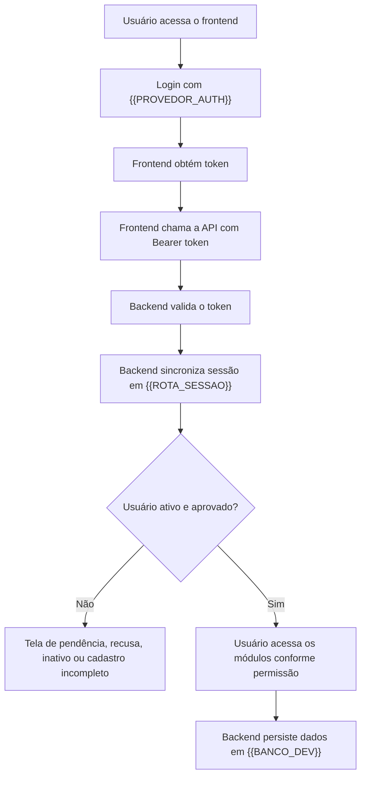
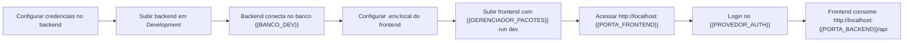
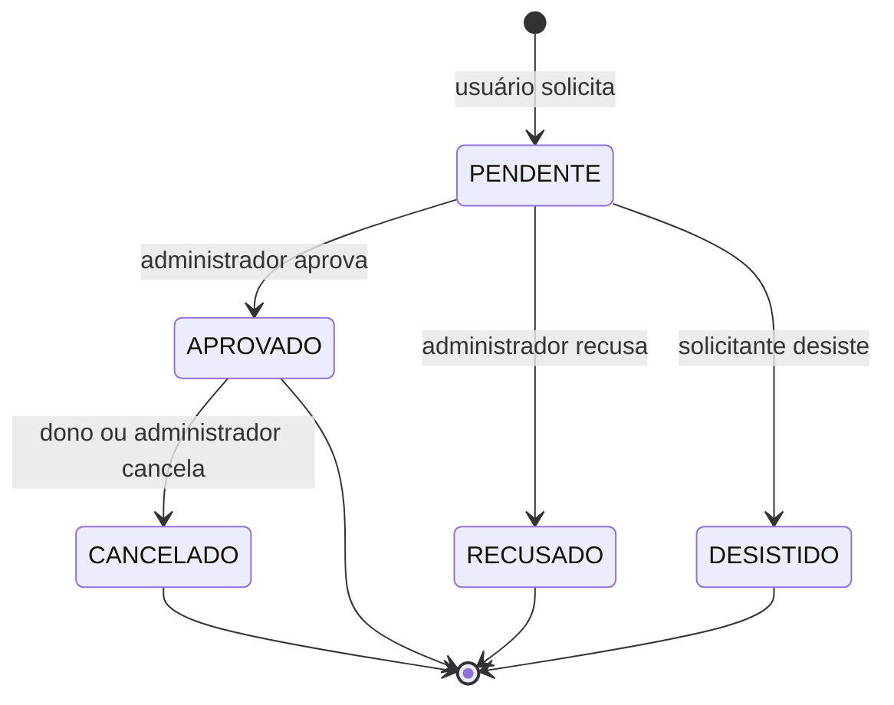
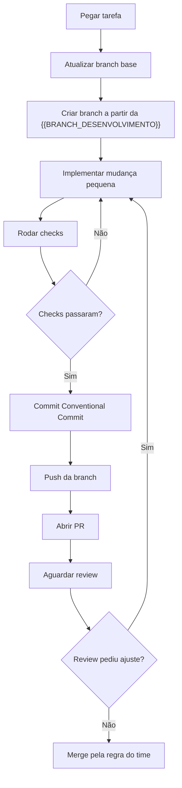

# {{NOME_DO_SISTEMA}} - Guia de onboarding

> **Template reutilizável.** Copie para a raiz do repositório como `README.md`, substitua todos os `{{PLACEHOLDERS}}`, apague os blocos `<!-- guia: ... -->` e a seção "Como adaptar este template" ao final.

Este README explica como rodar o {{NOME_DO_SISTEMA}}, como frontend e backend se conectam, quais variáveis de ambiente são necessárias, quais regras de negócio precisam ser respeitadas e qual fluxo usar para commits e pull requests.

## Sumário

- [Guia rápido](#guia-rápido)
- [Projeto e arquitetura](#projeto-e-arquitetura)
- [Ambiente e variáveis](#ambiente-e-variáveis)
- [Boas práticas](#boas-práticas)
- [Como rodar](#como-rodar)
- [Testes unitários](#testes-unitários)
- [Regras de negócio](#regras-de-negócio)
- [Fluxo Git, commits e PRs](#fluxo-git-commits-e-prs)
- [Banco local opcional](#banco-local-opcional)

<details>
<summary><b>Placeholders deste template</b> (apagar depois de preencher)</summary>

| Placeholder | Significado |
|---|---|
| `{{NOME_DO_SISTEMA}}` | Nome do sistema |
| `{{PASTA_RAIZ}}` | Pasta raiz do monorepo/repositório |
| `{{PASTA_BACKEND}}` | Caminho do projeto de backend |
| `{{PASTA_FRONTEND}}` | Caminho do projeto de frontend |
| `{{STACK_BACKEND}}` | Stack do backend |
| `{{STACK_FRONTEND}}` | Stack do frontend |
| `{{PORTA_BACKEND}}` / `{{PORTA_FRONTEND}}` | Portas locais |
| `{{HOST_DB_DEV}}`, `{{BANCO_DEV}}`, `{{BANCO_PROD}}` | Banco de desenvolvimento e produção |
| `{{PROVEDOR_AUTH}}` | Provedor de identidade/autenticação |
| `{{GERENCIADOR_PACOTES}}` | `pnpm`, `npm`, `yarn`... |
| `{{SHELL_PADRAO}}` | `powershell` ou `bash` |
| `{{BRANCH_PRODUCAO}}` / `{{BRANCH_DESENVOLVIMENTO}}` | Branches principais |
| `{{PREFIXO_ISSUE}}` | Prefixo de issue usado nas branches |

</details>

## Guia rápido

<details open>
<summary>Passos essenciais para subir o projeto</summary>

1. Instale as ferramentas base: Git, {{RUNTIME_BACKEND}}, {{RUNTIME_FRONTEND}} e {{GERENCIADOR_PACOTES}}.
2. Pegue no canal interno de chaves/variáveis:
   - credenciais do provedor de autenticação ({{PROVEDOR_AUTH}});
   - senha do banco remoto compartilhado;
   - variáveis públicas do frontend;
   - chaves/base URLs de integrações externas, se for testá-las.
3. Salve arquivos de credencial **fora do repositório**, por exemplo:

```text
{{CAMINHO_CREDENCIAL_LOCAL}}
```

4. Suba o backend em `Development`, a partir da pasta raiz `{{PASTA_RAIZ}}`:

```{{SHELL_PADRAO}}
cd {{PASTA_BACKEND}}
{{CMD_RESTORE_BACKEND}}
{{CMD_SET_ENV_DESENVOLVIMENTO}}
{{CMD_RUN_BACKEND}}
```

5. Valide o backend abrindo:

```text
http://localhost:{{PORTA_BACKEND}}/{{ROTA_DOC_API}}
```

6. Em outro terminal, crie o arquivo de variáveis do frontend:

```{{SHELL_PADRAO}}
cd {{PASTA_FRONTEND}}
copy .env.example .env.local
```

7. Preencha o `.env.local`:

```env
{{VAR_URL_API}}=http://localhost:{{PORTA_BACKEND}}
{{VAR_AUTH_1}}=
{{VAR_AUTH_2}}=
{{VAR_AUTH_3}}=
```

8. Suba o frontend:

```{{SHELL_PADRAO}}
{{GERENCIADOR_PACOTES}} install
{{GERENCIADOR_PACOTES}} run dev
```

9. Acesse:

```text
http://localhost:{{PORTA_FRONTEND}}
```

Se o backend não subir, veja `Como rodar > Problemas comuns no backend`.

</details>

## Projeto e arquitetura

<details>
<summary>O que é o {{NOME_DO_SISTEMA}}</summary>

O {{NOME_DO_SISTEMA}} é uma aplicação para {{OBJETIVO_DO_SISTEMA}}.

O sistema permite:

- {{CAPACIDADE_1}};
- {{CAPACIDADE_2}};
- {{CAPACIDADE_3}};
- {{CAPACIDADE_4}};
- registrar histórico de ações e auditoria.

| Projeto | Pasta | Tecnologia | Porta local |
|---|---|---|---|
| Backend | `{{PASTA_BACKEND}}` | {{STACK_BACKEND}} | `http://localhost:{{PORTA_BACKEND}}` |
| Frontend | `{{PASTA_FRONTEND}}` | {{STACK_FRONTEND}} | `http://localhost:{{PORTA_FRONTEND}}` |

<!-- guia: acrescente linhas para workers, jobs, gateway ou mobile, se existirem. -->

</details>

<details>
<summary>Fluxo geral da aplicação</summary>



</details>

## Ambiente e variáveis

<details>
<summary>Banco remoto compartilhado</summary>

Para desenvolvimento compartilhado, use o banco remoto `{{BANCO_DEV}}`.

| Campo | Valor |
|---|---|
| Host | `{{HOST_DB_DEV}}` |
| Porta | `{{PORTA_DB}}` |
| Banco | `{{BANCO_DEV}}` |
| Usuário | `{{USUARIO_DB}}` |
| Schema | `{{SCHEMA_DB}}` |

Não aponte o ambiente `Development` para o banco `{{BANCO_PROD}}`, que é o banco de produção.

Referência:

```env
DB_HOST={{HOST_DB_DEV}}
DB_PORT={{PORTA_DB}}
DB_NAME={{BANCO_DEV}}
DB_USER={{USUARIO_DB}}
DB_PASSWORD=<senha>
SCHEMA={{SCHEMA_DB}}
```

Se precisar sobrescrever a connection string por variável de ambiente:

```{{SHELL_PADRAO}}
{{CMD_SET_CONNECTION_STRING}}
```

</details>

<details>
<summary>Variáveis do backend</summary>

Obrigatório para autenticar tokens do {{PROVEDOR_AUTH}}:

| Opção | Variável/configuração | Quando usar |
|---|---|---|
| Segredo completo em variável | `{{VAR_CREDENCIAL_JSON}}` | container/servidor |
| Caminho do arquivo de credencial | `{{VAR_CREDENCIAL_PATH}}` | desenvolvimento local |
| Credencial padrão do provedor | `{{VAR_CREDENCIAL_PADRAO}}` | alternativa aceita pelo SDK |
| Configuração da aplicação | `{{CHAVE_CONFIG_APP}}` | user secrets ou arquivo de configuração local |

Exemplo:

```{{SHELL_PADRAO}}
{{CMD_SET_CREDENCIAL}}
```

Para integrações externas, quando o responsável técnico fornecer as chaves:

| Configuração da aplicação | Variável de ambiente equivalente |
|---|---|
| `{{CHAVE_CONFIG_INTEGRACAO_1}}` | `{{VAR_INTEGRACAO_1}}` |
| `{{CHAVE_CONFIG_INTEGRACAO_2}}` | `{{VAR_INTEGRACAO_2}}` |

Essas variáveis são necessárias apenas para testar a integração externa. Para subir a API usando dados já cadastrados no banco, elas não são obrigatórias.

Configurar apenas no terminal atual:

```{{SHELL_PADRAO}}
{{CMD_SET_VARS_INTEGRACAO}}
```

Depois rode o backend no mesmo terminal:

```{{SHELL_PADRAO}}
{{CMD_RUN_BACKEND}}
```

Alternativa com gerenciador de segredos local, a partir de `{{PASTA_BACKEND}}`:

```{{SHELL_PADRAO}}
{{CMD_USER_SECRETS}}
```

</details>

<details>
<summary>Variáveis do frontend</summary>

Arquivo local:

```text
{{PASTA_FRONTEND}}/.env.local
```

Crie a partir do exemplo:

```{{SHELL_PADRAO}}
cd {{PASTA_FRONTEND}}
copy .env.example .env.local
```

Variáveis obrigatórias:

```env
{{VAR_URL_API}}=http://localhost:{{PORTA_BACKEND}}
{{VAR_AUTH_1}}=
{{VAR_AUTH_2}}=
{{VAR_AUTH_3}}=
```

`{{VAR_URL_API}}` deve apontar para a URL base do backend, sem sufixo de rota. O arquivo `.env.local` não deve ser commitado.

</details>

## Boas práticas

<details open>
<summary>Cuidados no banco compartilhado</summary>

O banco `{{BANCO_DEV}}` é compartilhado por toda a equipe. Qualquer alteração pode afetar outros desenvolvedores.

- não rode `DELETE`, `UPDATE` ou scripts manuais sem confirmar o escopo;
- não rode migrations novas sem avisar a equipe;
- lembre que a API pode executar migrations pendentes ao iniciar;
- antes de mexer em dados reais, faça diagnóstico com `SELECT`;
- para testes destrutivos, prefira o ambiente `Local` com Docker.

Quando a tarefa precisar alterar estrutura de banco, explique no PR:

- qual migration foi criada;
- qual tabela ou coluna mudou;
- se existe risco para o banco compartilhado;
- se precisa de seed ou ajuste manual.

</details>

## Como rodar

<details open>
<summary>Backend: setup completo</summary>

Siga estes passos a partir da pasta raiz do projeto `{{PASTA_RAIZ}}`.

### 1. Entrar na pasta do backend

```{{SHELL_PADRAO}}
cd {{PASTA_BACKEND}}
```

### 2. Restaurar dependências

```{{SHELL_PADRAO}}
{{CMD_RESTORE_BACKEND}}
```

### 3. Configurar ambiente de desenvolvimento

```{{SHELL_PADRAO}}
{{CMD_SET_ENV_DESENVOLVIMENTO}}
```

O ambiente `Development` deve apontar para o banco remoto compartilhado `{{BANCO_DEV}}`.

### 4. Configurar credenciais do provedor de autenticação

Peça ao responsável técnico o arquivo de credencial e salve em uma pasta local fora do repositório.

Exemplo:

```text
{{CAMINHO_CREDENCIAL_LOCAL}}
```

Depois configure a variável:

```{{SHELL_PADRAO}}
{{CMD_SET_CREDENCIAL}}
```

### 5. Conferir banco remoto compartilhado

O backend em desenvolvimento usa:

| Campo | Valor |
|---|---|
| Host | `{{HOST_DB_DEV}}` |
| Porta | `{{PORTA_DB}}` |
| Banco | `{{BANCO_DEV}}` |
| Usuário | `{{USUARIO_DB}}` |
| Schema | `{{SCHEMA_DB}}` |

A senha do banco deve ser consultada no canal interno de chaves/variáveis.

### 6. Rodar a API

```{{SHELL_PADRAO}}
{{CMD_RUN_BACKEND}}
```

### 7. Validar que funcionou

Abra no navegador:

```text
http://localhost:{{PORTA_BACKEND}}/{{ROTA_DOC_API}}
```

Se a documentação da API abrir, o backend subiu corretamente.

URLs úteis:

| URL | Uso |
|---|---|
| `http://localhost:{{PORTA_BACKEND}}` | raiz da API |
| `http://localhost:{{PORTA_BACKEND}}/{{ROTA_DOC_API}}` | documentação interativa da API |
| `http://localhost:{{PORTA_BACKEND}}/api` | prefixo usado pelo frontend |
| `{{URL_REALTIME}}` | canal de tempo real, se houver |

### 8. Rodar testes do backend

```{{SHELL_PADRAO}}
{{CMD_TEST_BACKEND}}
```

</details>

<details>
<summary>Problemas comuns no backend</summary>

### Erro de credencial

Se aparecer erro relacionado à credencial do provedor de autenticação, confira se a variável abaixo aponta para um arquivo real:

```{{SHELL_PADRAO}}
{{VAR_CREDENCIAL_PATH}}
```

### Erro de conexão com banco

Confirme se:

- você está na rede/VPN necessária;
- a senha do banco está correta;
- o ambiente está como `Development`;
- o banco usado é `{{BANCO_DEV}}`, não `{{BANCO_PROD}}`.

### Porta ocupada

Rode em outra porta:

```{{SHELL_PADRAO}}
{{CMD_RUN_BACKEND_PORTA_ALTERNATIVA}}
```

Se mudar a porta do backend, atualize também o frontend:

```env
{{VAR_URL_API}}=http://localhost:{{PORTA_BACKEND_ALTERNATIVA}}
```

### Subi com o perfil errado e conectei no banco errado

Cada perfil de execução aponta para um ambiente diferente. Para usar o banco remoto compartilhado, rode:

```{{SHELL_PADRAO}}
{{CMD_RUN_BACKEND}}
```

<!-- guia: liste aqui os perfis reais do projeto e a qual banco cada um aponta. É o erro mais comum de quem entra no time. -->

</details>

<details>
<summary>Frontend</summary>

```{{SHELL_PADRAO}}
cd {{PASTA_FRONTEND}}
{{GERENCIADOR_PACOTES}} install
{{GERENCIADOR_PACOTES}} run dev
```

Acesse:

```text
http://localhost:{{PORTA_FRONTEND}}
```

</details>

<details>
<summary>Fluxo de execução local</summary>



</details>

## Testes unitários

<details open>
<summary>Quando escrever testes</summary>

Teste unitário não é etapa opcional quando a mudança altera comportamento. Use testes principalmente para:

- regras de negócio do domínio;
- validações de permissão, status e acesso;
- normalizadores, mapeamentos, formatadores e helpers;
- services com decisão de fluxo;
- contratos de API ou DTOs usados pelo frontend;
- bugs corrigidos, para evitar regressão.

Mudanças somente documentais, ajustes simples de configuração ou alterações visuais sem lógica podem ser validadas por build e teste manual, desde que isso fique explicado no PR.

</details>

<details>
<summary>Backend: como rodar os testes</summary>

O backend possui projeto de testes em:

```text
{{PASTA_TESTES_BACKEND}}
```

Tecnologias usadas:

- {{FERRAMENTA_TESTE_1}};
- {{FERRAMENTA_TESTE_2}};
- {{FERRAMENTA_COBERTURA}}.

Rodar todos os testes do backend:

```{{SHELL_PADRAO}}
{{CMD_TEST_BACKEND}}
```

Rodar com mais detalhes no terminal:

```{{SHELL_PADRAO}}
{{CMD_TEST_BACKEND_VERBOSE}}
```

Rodar filtrando uma classe ou nome de teste:

```{{SHELL_PADRAO}}
{{CMD_TEST_BACKEND_FILTRO}}
```

Antes de abrir PR no backend, o mínimo esperado é:

```{{SHELL_PADRAO}}
{{CMD_BUILD_BACKEND}}
{{CMD_TEST_BACKEND}}
```

</details>

<details>
<summary>Frontend: situação atual dos testes</summary>

<!-- guia: se o projeto já tem runner de teste no frontend, substitua este bloco pelo comando real e apague o texto de transição. -->

No momento, o frontend {{SITUACAO_TESTES_FRONTEND}}.

Enquanto o runner de testes do frontend não for configurado, para PRs de frontend rode pelo menos:

```{{SHELL_PADRAO}}
cd {{PASTA_FRONTEND}}
{{CMD_BUILD_FRONTEND}}
{{CMD_LINT_FRONTEND}}
```

Quando a tarefa alterar componente, hook, service, utilitário ou comportamento de tela, registre no PR:

- qual comportamento deveria ser coberto por teste unitário;
- se houve validação manual;
- quais telas, estados ou fluxos foram testados;
- se a falta de teste depende de configurar runner no frontend.

Quando o projeto passar a ter runner de teste, o comando padrão esperado deve ser:

```{{SHELL_PADRAO}}
{{CMD_TEST_FRONTEND}}
```

Esse comando também deve ser incluído no CI quando estiver disponível.

</details>

<details>
<summary>Como decidir o que testar</summary>

Use esta regra simples:

| Mudança | Teste esperado |
|---|---|
| Regra de negócio no backend | Teste unitário ou de service cobrindo sucesso e falha |
| Permissão/status/acesso | Teste cobrindo usuário permitido e usuário bloqueado |
| Mapper/normalizador/helper | Teste com entradas válidas, vazias e inválidas |
| Endpoint novo ou contrato alterado | Teste do service/controller ou contrato do DTO |
| Componente com comportamento | Teste do componente quando o runner existir |
| Ajuste visual simples | Build, validação manual e print no PR |
| Documentação | Revisão dos comandos e links citados |

</details>

## Regras de negócio

<!-- guia: esta é a seção mais específica do projeto. Mantenha a estrutura (atores/permissões → entidade principal + máquina de estados → entidades de apoio) e troque o conteúdo. -->

<details>
<summary>Usuários e permissões</summary>

O usuário autentica pelo {{PROVEDOR_AUTH}}, mas o acesso real ao sistema depende do registro correspondente no banco da aplicação.

Estados de acesso:

- `APROVADO`: usuário pode usar o sistema conforme seu tipo.
- `PENDENTE_APROVACAO`: usuário autenticou, mas aguarda liberação administrativa.
- `INATIVO`: usuário existe, mas está bloqueado.
- `RECUSADO`: solicitação de acesso foi recusada.

Tipos de usuário:

| Tipo | Pode fazer |
|---|---|
| Administrador | {{PERMISSOES_ADMIN}} |
| Normal | {{PERMISSOES_NORMAL}} |
| Visualizador | {{PERMISSOES_VISUALIZADOR}} |

</details>

<details>
<summary>{{ENTIDADE_PRINCIPAL}}</summary>

Todo {{ENTIDADE_PRINCIPAL_SINGULAR}} pertence a {{RELACIONAMENTOS_OBRIGATORIOS}}.

Regras importantes:

- novos registros começam como `PENDENTE`;
- visualizadores não podem criar nem alterar registros;
- administradores podem aprovar, recusar e gerenciar status;
- usuários normais só agem sobre os próprios registros, conforme a regra;
- dados históricos (ex: setor no momento do registro) ficam gravados no próprio registro, e não devem ser inferidos depois a partir do estado atual do usuário.



</details>

<details>
<summary>Entidades de apoio e catálogos</summary>

{{ENTIDADE_APOIO_1}}:

- possuem atributos de disponibilidade e restrição de uso;
- itens indisponíveis não devem ser tratados como opção normal;
- conflitos precisam ser validados no backend, nunca só no frontend.

Catálogos ({{ENTIDADE_APOIO_2}}):

- o catálogo é controlado pelo backend;
- o frontend deve usar a lista vinda do backend;
- inclusões novas passam por aprovação;
- migrations que mexem no catálogo precisam ser revisadas com cuidado.

</details>

## Fluxo Git, commits e PRs

<details open>
<summary>Regras obrigatórias de commit</summary>

Use Conventional Commits, sempre em mensagem curta e objetiva:

```text
feat: adiciona filtro de itens por disponibilidade
fix: corrige cancelamento de registro aprovado
docs: atualiza guia de onboarding
refactor: reorganiza serviço de domínio
test: cobre validação de entrada no cadastro
chore: ajusta configuração de desenvolvimento
```

Prefira mensagens em {{IDIOMA_PADRAO}}, descrevendo o que mudou e por que quando isso couber em uma linha.

</details>

<details>
<summary>Branches</summary>

Use Git Flow para escolher o prefixo da branch:

| Tipo | Quando usar | Exemplo |
|---|---|---|
| `feature/` | nova funcionalidade | `feature/{{PREFIXO_ISSUE}}-12-nome-curto` |
| `bugfix/` | correção sem urgência de produção | `bugfix/{{PREFIXO_ISSUE}}-13-listagem` |
| `hotfix/` | correção urgente em produção | `hotfix/{{PREFIXO_ISSUE}}-14-erro-critico` |
| `docs/` | documentação | `docs/{{PREFIXO_ISSUE}}-15-onboarding` |
| `chore/` | configuração/manutenção | `chore/{{PREFIXO_ISSUE}}-16-ambiente-dev` |

Fluxo recomendado:

```{{SHELL_PADRAO}}
git checkout {{BRANCH_DESENVOLVIMENTO}}
git pull origin {{BRANCH_DESENVOLVIMENTO}}
git checkout -b feature/{{PREFIXO_ISSUE}}-123-nome-curto
```

Depois de alterar os arquivos:

```{{SHELL_PADRAO}}
git status
git diff
git add caminho/do/arquivo
git commit -m "feat: resumo objetivo da mudança"
git push -u origin feature/{{PREFIXO_ISSUE}}-123-nome-curto
```

Abra o PR sempre para `{{BRANCH_DESENVOLVIMENTO}}`. Use o código da tarefa do rastreador no nome da branch quando existir.

</details>

<details>
<summary>Antes de commitar</summary>

Revise o escopo:

```{{SHELL_PADRAO}}
git status
git diff
```

Rode os checks conforme o que foi alterado:

| Mudança | Check mínimo |
|---|---|
| Backend | `{{CMD_BUILD_BACKEND}}` |
| Backend com regra de negócio | `{{CMD_TEST_BACKEND}}` |
| Frontend | `{{CMD_BUILD_FRONTEND}}` |
| Frontend com comportamento novo | teste unitário quando houver runner; enquanto não houver, documentar validação manual no PR |
| Frontend com lint relevante | `{{CMD_LINT_FRONTEND}}` se o lint estiver limpo no contexto |
| Migration/modelo de banco | revisar migration e validar que não aponta para banco errado |
| Documentação | reler comandos, URLs e variáveis citadas |

Depois:

```{{SHELL_PADRAO}}
git add caminho/do/arquivo
git commit -m "tipo: resumo objetivo da mudança"
```

Não use `git add .` sem revisar antes.

</details>

<details>
<summary>Abrindo Pull Request</summary>

Antes do PR:

1. garanta que a branch está atualizada com a base combinada;
2. rode os checks mínimos;
3. confirme que não há secrets novos, `.env.local`, dumps ou arquivos temporários;
4. confirme que migrations, scripts SQL ou alterações de banco estão explicadas no PR.

Push:

```{{SHELL_PADRAO}}
git push -u origin feature/{{PREFIXO_ISSUE}}-123-nome-curto
```

Título do PR também deve seguir Conventional Commits:

```text
feat: adiciona filtro de itens por disponibilidade
```

Descrição sugerida:

```md
## Resumo
- O que mudou
- Por que mudou

## Validação
- [ ] {{CMD_BUILD_BACKEND}}
- [ ] {{CMD_TEST_BACKEND}}
- [ ] {{CMD_BUILD_FRONTEND}}
- [ ] {{CMD_LINT_FRONTEND}}
- [ ] teste manual do fluxo afetado
- [ ] prints/vídeo quando houver mudança visual

## Riscos / observações
- Migrations:
- Banco:
- Variáveis de ambiente:
- Testes não criados:
```

Se o PR tocar frontend visual, inclua print ou descreva claramente o fluxo testado.

</details>

<details>
<summary>Fluxograma de branch e PR</summary>



</details>

## Banco local opcional

<details>
<summary>Quando usar Docker local</summary>

Use o ambiente `Local` quando precisar de banco descartável na sua máquina, principalmente para migrations, testes destrutivos ou experimentos.

```{{SHELL_PADRAO}}
docker compose -f docker-compose.local.yml up -d
cd {{PASTA_BACKEND}}
{{CMD_RUN_BACKEND_LOCAL}}
```

Banco local:

| Campo | Valor |
|---|---|
| Host | `localhost` |
| Porta | `{{PORTA_DB_LOCAL}}` |
| Banco | `{{BANCO_LOCAL}}` |
| Usuário | `{{USUARIO_DB_LOCAL}}` |
| Senha | `{{SENHA_DB_LOCAL}}` |
| Schema | `{{SCHEMA_DB}}` |

Para parar:

```{{SHELL_PADRAO}}
docker compose -f docker-compose.local.yml down
```

</details>

---

## Como adaptar este template a um novo projeto

<!-- guia: apague esta seção inteira depois de preencher. -->

1. **Preencha os placeholders na ordem do arquivo.** O "Guia rápido" é o que mais gente lê e o que mais rápido fica desatualizado — valide cada comando rodando de verdade em uma máquina limpa antes de commitar.
2. **Não invente credenciais.** Onde o template diz "canal interno de chaves/variáveis", aponte para o canal real (Vault, 1Password, Teams). Nunca coloque senha, connection string real ou chave de API no README.
3. **Ajuste o número de camadas.** Se o projeto tem só backend, apague as seções de frontend inteiras em vez de deixar `{{...}}` órfão. Se tem mobile ou worker, duplique o padrão das seções existentes.
4. **Regras de negócio são o coração do arquivo.** A máquina de estados em Mermaid deve refletir os status reais do domínio. Se o domínio não tem aprovação/recusa, troque o diagrama inteiro em vez de forçar o modelo.
5. **Mantenha a duplicação consciente com o `CLAUDE.md`.** As seções de commit, branch e checks aparecem nos dois arquivos de propósito: o README é para humanos, o `CLAUDE.md` é para o agente. Quando mudar uma regra, mude nos dois.
6. **`<details>` fechado é o padrão.** Deixe `<details open>` apenas no Guia rápido, em Boas práticas e nas regras que ninguém pode deixar de ler.
